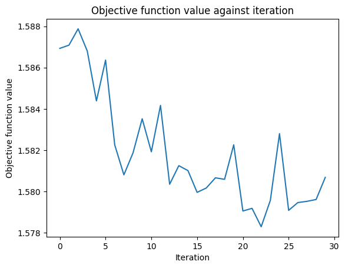

# QiskitAI
Machine Learning Algorithms implemented using Qiskit Machine Learning SDK.

## Goal
Implementing and comparing different quantum machine learning algorithms and analyzing current constraints.

## Input
Input is an MNIST dataset consisting of handwritten digits. To represent the classical data for quantum processing, we reduce the image dimensions from 28x28 image

 

to 4x4 image

 

so that we can use 16 qubits to represent 1 image. The images are processed through the ZZFeatureMap, which encodes classical data into a quantum representation that can then be processed by the quantum algorithm.

## Algorithms
We use 2 different circuits
* [QNN-MNIST.ipynb](./QNN-MNIST.ipynb) - Implements a Quantum Neural Network (QNN) with a simple Ansatz using RealAmplitudes with three reps, which contains the model parameters that need to be trained. 
* [QCNN-MNIST.ipynb](./QCNN-MNIST.ipynb) - Implements Convolutional and Pooling layers to create a Quantum Convolutional Neural Network (QCNN)

## Output
The model returns the number it predicts to be in the image. Both models are multiclass, classifying 4 different digits.

## Current Observations
No significant differences were noticed in training time. Both the QNN and QCNN had similar training times for the same number of epochs.

The QNN had a relatively low accuracy for the training dataset despite the objective function value plateauing. This is likely due to the limited complexity of the algorithm, causing the model to be underfitted. It is likely necessary to increase the complexity of the circuit/ansatz to more effectively fit the model to the data. This can be achieved by increasing the number of reps and adding more hidden layers. This was not tested as the training time became too high (although increasing reps from 1 to 3 showed a slight improvement). Greater computing power is needed to simulate the circuit in order to test this hypothesis.

The QCNN, on the other hand, suffered a different problem. The accuracy of the model on the training dataset was, in general, much higher than the accuracy of the testing dataset. This suggests that the model was being overfitted according to the training dataset. This is likely due to the low dimensionality (4x4) of the used dataset, impacting the ability of the model to learn patterns accordingly. This can be combated by increasing dimensionality or modifying the circuit. However, due to the limitation/size restriction on simulating quantum systems, any image greater than 4x4 had too many qubits to be processed.

## Future Aim / Next Steps
As discussed, QNN performance can likely be increased by improving the complexity of the circuit. This might require letting the model train for a much longer period of time (multiple days) to be able to get a more effective accuracy. To improve QCNN performance, ways of encoding information more efficiently, rather than the 1 pixel: 1 qubit ratio, need to be used. Otherwise, limiting the number of epochs and expanding the utilized training dataset can be attempted. Therefore, more training time is needed for both models.
